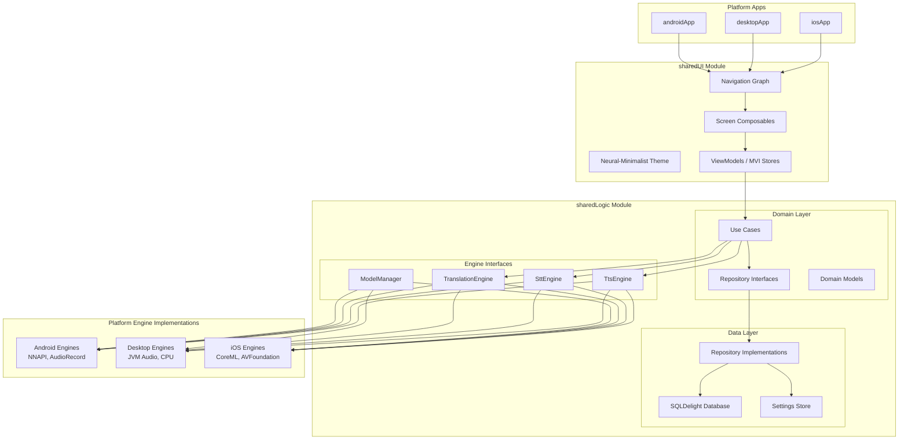
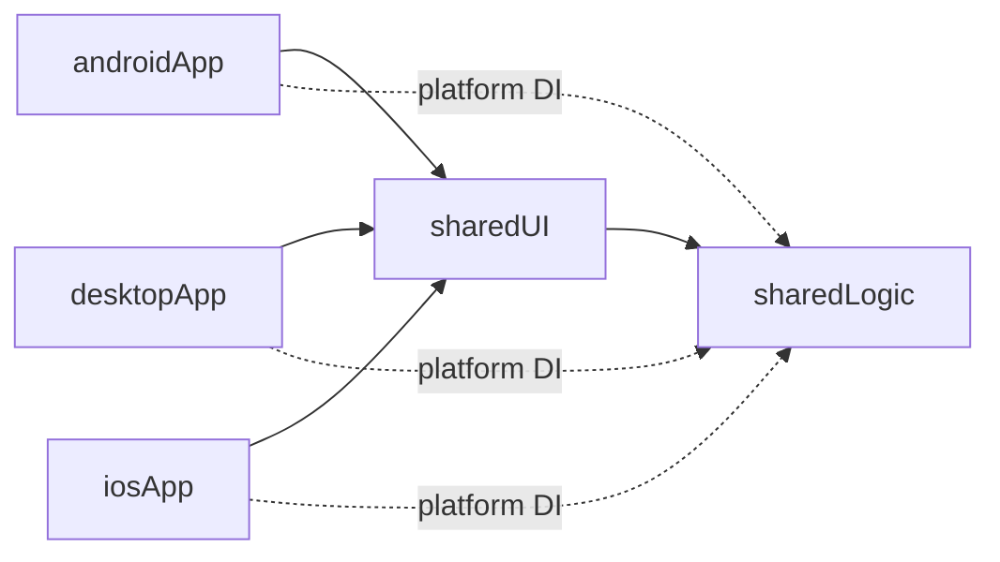
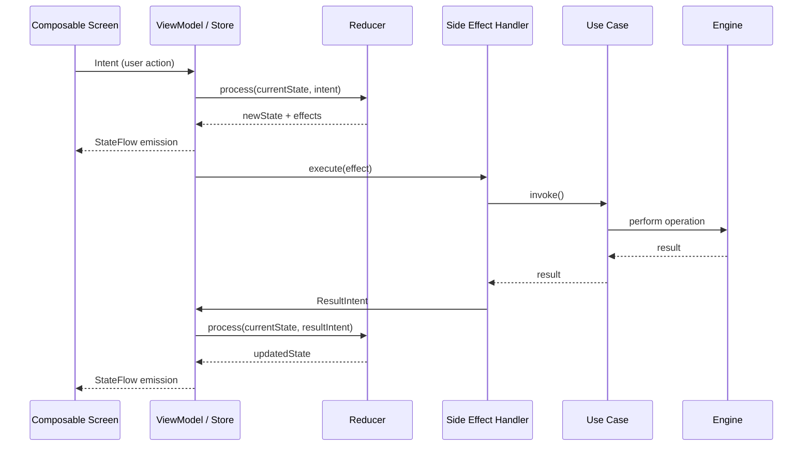
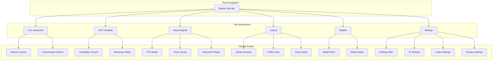
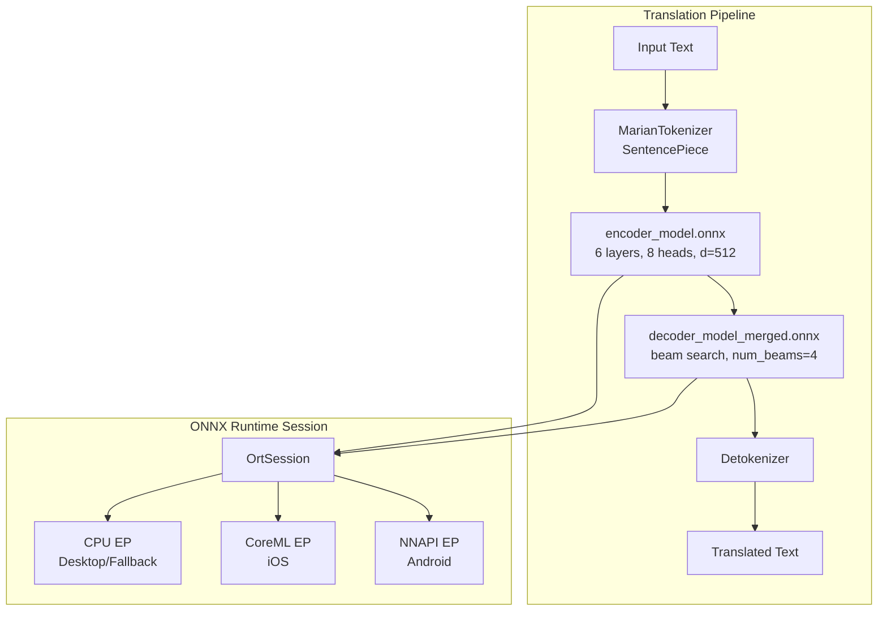

# Design Document: Lexi Translator

## Overview

Lexi Translator is a privacy-first, fully offline AI translation platform built with Kotlin Multiplatform (KMP) and Compose Multiplatform (CMP). The system runs OPUS-MT translation models, Whisper STT models, and Kokoro/Piper/VITS TTS engines entirely on-device using ONNX Runtime. The architecture separates shared business logic from platform-specific AI engine implementations, enabling a unified codebase to target Android, Desktop (JVM), and iOS.

### Key Design Decisions

| Decision | Choice | Rationale |
|----------|--------|-----------|
| Translation Engine | ONNX Runtime + OPUS-MT int8 | Proven int8-quantised models (~30-45 MB), 512 token input, cross-platform ONNX Runtime support |
| STT Engine | Whisper (ONNX-converted) | State-of-art multilingual ASR, ONNX format enables same runtime as translation |
| TTS Engines | Kokoro, Piper, VITS | Multiple quality/speed tradeoffs; all support ONNX export |
| DI Framework | Koin (constructor injection only) | Lightweight, KMP-native, no code generation, no annotation processing |
| Navigation | Compose Navigation (type-safe) | First-party CMP support, compile-time argument safety |
| Database | SQLDelight + SQLCipher | KMP-native SQL, AES-256 encryption, compile-time query verification |
| Architecture | MVI (Model-View-Intent) | Unidirectional data flow, predictable state, testable reducers |
| State Management | Kotlin StateFlow + sealed classes | Native coroutines integration, exhaustive when-matching |
| Model Downloads | Custom manager with SHA-256 | Pause/resume, integrity verification, partial download retention |
| CI/CD | GitHub Actions | Multi-platform matrix builds, Crowdin sync, automated releases |

## Architecture

### System Architecture Diagram



### Module Dependency Graph



### MVI Data Flow



### Navigation Architecture



## Components and Interfaces

### Engine Interfaces (sharedLogic/commonMain)

```kotlin
// com.falconlabs.aitranslator.engine.translation

interface TranslationEngine {
    suspend fun translate(request: TranslationRequest): TranslationResult
    suspend fun detectLanguage(text: String): LanguageDetectionResult
    fun isModelLoaded(languagePair: LanguagePair): Boolean
    suspend fun loadModel(languagePair: LanguagePair): LoadResult
    suspend fun unloadModel(languagePair: LanguagePair)
    fun getLoadedModels(): List<LanguagePair>
}

data class TranslationRequest(
    val text: String,
    val sourceLang: LanguageCode,
    val targetLang: LanguageCode,
    val mode: TranslationMode = TranslationMode.DEFAULT,
    val maxTokens: Int = 256
)

data class TranslationResult(
    val translatedText: String,
    val confidence: TranslationConfidence,
    val alternatives: List<String> = emptyList(),
    val dictionaryEntry: DictionaryEntry? = null,
    val transliteration: String? = null,
    val processingTimeMs: Long
)

enum class TranslationMode { DEFAULT, FAST, ACCURATE, EXPERIMENTAL }
enum class TranslationConfidence { LOW, MEDIUM, HIGH }
```

```kotlin
// com.falconlabs.aitranslator.engine.stt

interface SttEngine {
    suspend fun startListening(config: SttConfig): Flow<SttEvent>
    suspend fun stopListening()
    fun isListening(): Boolean
    suspend fun loadModel(language: LanguageCode): LoadResult
    suspend fun unloadModel(language: LanguageCode)
}

sealed interface SttEvent {
    data class PartialTranscription(val text: String, val language: LanguageCode) : SttEvent
    data class FinalTranscription(val text: String, val language: LanguageCode, val confidence: Float) : SttEvent
    data class AudioLevel(val amplitude: Float) : SttEvent
    data class Error(val reason: SttError) : SttEvent
    data object SilenceDetected : SttEvent
}

data class SttConfig(
    val languages: List<LanguageCode>,
    val silenceThresholdMs: Long = 1500,
    val sampleRate: Int = 16000,
    val enableDualLanguage: Boolean = false
)
```

```kotlin
// com.falconlabs.aitranslator.engine.tts

interface TtsEngine {
    suspend fun synthesize(request: TtsRequest): Flow<TtsEvent>
    suspend fun stop()
    fun isSpeaking(): Boolean
    suspend fun loadVoice(voiceProfile: VoiceProfileId): LoadResult
    suspend fun unloadVoice(voiceProfile: VoiceProfileId)
    fun getSupportedFormats(): List<AudioFormat>
}

sealed interface TtsEvent {
    data class AudioChunk(val data: ByteArray, val format: AudioFormat) : TtsEvent
    data class Progress(val charIndex: Int, val totalChars: Int) : TtsEvent
    data object Completed : TtsEvent
    data class Error(val reason: TtsError, val skippedSegment: String?) : TtsEvent
}

data class TtsRequest(
    val text: String,
    val voiceProfile: VoiceProfileId,
    val speed: Float = 1.0f,       // 0.5 - 3.0
    val pitch: Float = 1.0f,       // 0.5 - 2.0
    val pauseDuration: Float = 0f, // 0 - 5.0 seconds
    val volume: Float = 1.0f       // 0.0 - 1.0
)

enum class AudioFormat { WAV, MP3, FLAC, OGG }
```

```kotlin
// com.falconlabs.aitranslator.engine.model

interface ModelManager {
    fun getAvailableModels(): Flow<List<AiModel>>
    fun getInstalledModels(): Flow<List<InstalledModel>>
    suspend fun downloadModel(modelId: ModelId): Flow<DownloadProgress>
    suspend fun pauseDownload(modelId: ModelId)
    suspend fun resumeDownload(modelId: ModelId)
    suspend fun cancelDownload(modelId: ModelId)
    suspend fun deleteModel(modelId: ModelId): DeleteResult
    suspend fun verifyIntegrity(modelId: ModelId): IntegrityResult
    fun getStorageUsage(): Flow<StorageUsage>
    fun getRecommendations(deviceProfile: DeviceProfile): List<ModelRecommendation>
}

data class DownloadProgress(
    val modelId: ModelId,
    val bytesDownloaded: Long,
    val totalBytes: Long,
    val speedBytesPerSec: Long,
    val state: DownloadState
)

enum class DownloadState { QUEUED, DOWNLOADING, PAUSED, VERIFYING, COMPLETED, FAILED }
```

### Repository Interfaces

```kotlin
// com.falconlabs.aitranslator.data.repository

interface LibraryRepository {
    fun getEntries(filter: LibraryFilter): Flow<PaginatedResult<LibraryEntry>>
    fun searchEntries(query: String, filter: LibraryFilter): Flow<List<LibraryEntry>>
    suspend fun saveEntry(entry: LibraryEntry): EntryId
    suspend fun deleteEntries(ids: List<EntryId>)
    suspend fun moveToFolder(ids: List<EntryId>, folderId: FolderId)
    suspend fun applyTags(ids: List<EntryId>, tags: List<Tag>)
    suspend fun exportEntries(ids: List<EntryId>, format: ExportFormat): ExportResult
    fun getFolders(): Flow<List<Folder>>
    suspend fun createFolder(name: String, parentId: FolderId?): FolderId
    fun getStorageUsage(): Flow<Long>
}

interface SettingsRepository {
    fun getSettings(): Flow<AppSettings>
    suspend fun updateSetting(key: SettingKey, value: Any)
    suspend fun resetToDefaults()
    suspend fun exportAllData(): ExportResult
    suspend fun clearHistory()
    suspend fun clearCache()
}

interface SessionRepository {
    suspend fun saveSessionState(state: SessionState)
    suspend fun recoverSession(): SessionState?
    suspend fun clearSession()
}
```

### Koin DI Module Structure

```kotlin
// com.falconlabs.aitranslator.di

// Common modules (sharedLogic)
val domainModule = module {
    factory { TranslateTextUseCase(get(), get()) }
    factory { DetectLanguageUseCase(get()) }
    factory { LiveInterpreterUseCase(get(), get(), get(), get()) }
    factory { SynthesizeSpeechUseCase(get(), get()) }
    factory { ManageModelsUseCase(get(), get()) }
    factory { LibraryUseCase(get()) }
    factory { SessionRecoveryUseCase(get()) }
}

val dataModule = module {
    single<LibraryRepository> { SqlDelightLibraryRepository(get()) }
    single<SettingsRepository> { DataStoreSettingsRepository(get()) }
    single<SessionRepository> { SqlDelightSessionRepository(get()) }
    single { LexiDatabase(get()) } // SQLDelight driver provided per platform
}

// sharedUI module
val viewModelModule = module {
    viewModel { LiveInterpreterViewModel(get(), get()) }
    viewModel { TextTranslateViewModel(get(), get(), get()) }
    viewModel { NeuralSpeakViewModel(get(), get()) }
    viewModel { LibraryViewModel(get()) }
    viewModel { ModelStoreViewModel(get()) }
    viewModel { SettingsViewModel(get()) }
}

// Platform modules (androidApp, desktopApp, iosApp)
// Each provides: SqlDriver, TranslationEngine, SttEngine, TtsEngine, AudioPlayer
val androidPlatformModule = module {
    single<SqlDriver> { AndroidSqliteDriver(LexiDatabase.Schema, get(), "lexi.db", ...) }
    single<TranslationEngine> { OnnxTranslationEngine(get(), executionProvider = NNAPI) }
    single<SttEngine> { WhisperSttEngine(get(), audioSource = AudioRecordSource()) }
    single<TtsEngine> { MultiTtsEngine(get(), engines = listOf(KokoroEngine(), PiperEngine(), VitsEngine())) }
}

val desktopPlatformModule = module {
    single<SqlDriver> { JdbcSqliteDriver("jdbc:sqlite:lexi.db", ...) }
    single<TranslationEngine> { OnnxTranslationEngine(get(), executionProvider = CPU) }
    single<SttEngine> { WhisperSttEngine(get(), audioSource = JavaSoundSource()) }
    single<TtsEngine> { MultiTtsEngine(get(), engines = listOf(KokoroEngine(), PiperEngine(), VitsEngine())) }
}
```

### ONNX Runtime Integration Architecture



### Platform-Specific Execution Providers

| Platform | Primary EP | Fallback EP | Audio Source | File System |
|----------|-----------|-------------|-------------|-------------|
| Android | NNAPI | CPU | AudioRecord | Context.filesDir |
| Desktop (JVM) | CPU (multi-threaded) | — | javax.sound.sampled | ~/.lexi/models/ |
| iOS | CoreML | CPU | AVAudioEngine | NSDocumentDirectory |

## Data Models

### SQLDelight Schema

```sql
-- models.sq
CREATE TABLE installed_model (
    id TEXT NOT NULL PRIMARY KEY,
    name TEXT NOT NULL,
    category TEXT NOT NULL, -- 'translation', 'stt', 'tts'
    version TEXT NOT NULL,
    size_bytes INTEGER NOT NULL,
    source_lang TEXT,
    target_lang TEXT,
    engine_type TEXT, -- 'opus_mt', 'whisper', 'kokoro', 'piper', 'vits'
    file_path TEXT NOT NULL,
    sha256_checksum TEXT NOT NULL,
    installed_at INTEGER NOT NULL,
    last_used_at INTEGER,
    quality_rating REAL DEFAULT 0.0,
    ram_requirement_mb INTEGER DEFAULT 0
);

CREATE TABLE model_download (
    model_id TEXT NOT NULL PRIMARY KEY,
    state TEXT NOT NULL, -- 'queued', 'downloading', 'paused', 'verifying', 'completed', 'failed'
    bytes_downloaded INTEGER NOT NULL DEFAULT 0,
    total_bytes INTEGER NOT NULL,
    partial_file_path TEXT,
    started_at INTEGER NOT NULL,
    updated_at INTEGER NOT NULL,
    error_message TEXT,
    FOREIGN KEY (model_id) REFERENCES installed_model(id) ON DELETE CASCADE
);

-- library.sq
CREATE TABLE library_entry (
    id TEXT NOT NULL PRIMARY KEY,
    content_type TEXT NOT NULL, -- 'translation', 'speech', 'voice', 'document', 'conversation'
    source_text TEXT,
    translated_text TEXT,
    source_lang TEXT NOT NULL,
    target_lang TEXT NOT NULL,
    engine_used TEXT,
    voice_used TEXT,
    confidence TEXT, -- 'low', 'medium', 'high'
    is_favorite INTEGER NOT NULL DEFAULT 0,
    is_pinned INTEGER NOT NULL DEFAULT 0,
    folder_id TEXT,
    created_at INTEGER NOT NULL,
    updated_at INTEGER NOT NULL,
    FOREIGN KEY (folder_id) REFERENCES folder(id) ON DELETE SET NULL
);

CREATE TABLE folder (
    id TEXT NOT NULL PRIMARY KEY,
    name TEXT NOT NULL,
    parent_id TEXT,
    created_at INTEGER NOT NULL,
    depth INTEGER NOT NULL DEFAULT 0 CHECK (depth <= 3),
    FOREIGN KEY (parent_id) REFERENCES folder(id) ON DELETE CASCADE
);

CREATE TABLE tag (
    id TEXT NOT NULL PRIMARY KEY,
    name TEXT NOT NULL UNIQUE
);

CREATE TABLE entry_tag (
    entry_id TEXT NOT NULL,
    tag_id TEXT NOT NULL,
    PRIMARY KEY (entry_id, tag_id),
    FOREIGN KEY (entry_id) REFERENCES library_entry(id) ON DELETE CASCADE,
    FOREIGN KEY (tag_id) REFERENCES tag(id) ON DELETE CASCADE
);

CREATE INDEX idx_entry_content_type ON library_entry(content_type);
CREATE INDEX idx_entry_source_lang ON library_entry(source_lang);
CREATE INDEX idx_entry_target_lang ON library_entry(target_lang);
CREATE INDEX idx_entry_created_at ON library_entry(created_at);
CREATE INDEX idx_entry_folder ON library_entry(folder_id);
CREATE INDEX idx_entry_favorite ON library_entry(is_favorite);

-- Create FTS table for full-text search
CREATE VIRTUAL TABLE library_entry_fts USING fts5(
    source_text,
    translated_text,
    content='library_entry',
    content_rowid='rowid'
);

-- conversation.sq
CREATE TABLE conversation_card (
    id TEXT NOT NULL PRIMARY KEY,
    session_id TEXT NOT NULL,
    source_text TEXT NOT NULL,
    translated_text TEXT NOT NULL,
    source_lang TEXT NOT NULL,
    target_lang TEXT NOT NULL,
    confidence_score REAL NOT NULL,
    timestamp INTEGER NOT NULL,
    is_pinned INTEGER NOT NULL DEFAULT 0
);

CREATE INDEX idx_conversation_session ON conversation_card(session_id);
CREATE INDEX idx_conversation_timestamp ON conversation_card(timestamp);

-- session.sq
CREATE TABLE session_state (
    id INTEGER NOT NULL PRIMARY KEY DEFAULT 1,
    active_screen TEXT NOT NULL,
    conversation_json TEXT, -- serialized conversation state
    pending_input TEXT,
    last_saved_at INTEGER NOT NULL
);

-- settings.sq
CREATE TABLE user_setting (
    key TEXT NOT NULL PRIMARY KEY,
    value_json TEXT NOT NULL,
    updated_at INTEGER NOT NULL
);
```

### Domain Models (Kotlin)

```kotlin
// Language and Translation Models
@JvmInline value class LanguageCode(val code: String)
@JvmInline value class ModelId(val id: String)
@JvmInline value class VoiceProfileId(val id: String)
@JvmInline value class EntryId(val id: String)
@JvmInline value class FolderId(val id: String)

data class LanguagePair(
    val source: LanguageCode,
    val target: LanguageCode
) {
    val modelId: String get() = "Xenova/opus-mt-${source.code}-${target.code}"
}

data class AiModel(
    val id: ModelId,
    val name: String,
    val category: ModelCategory,
    val version: String,
    val sizeBytes: Long,
    val languagePair: LanguagePair?,
    val engineType: EngineType,
    val qualityRating: Float,
    val ramRequirementMb: Int,
    val cpuRequirement: CpuRequirement,
    val license: String,
    val publisher: String
)

enum class ModelCategory { TRANSLATION, STT, TTS }
enum class EngineType { OPUS_MT, WHISPER, KOKORO, PIPER, VITS }
enum class CpuRequirement { LOW, MEDIUM, HIGH }

// Library Models
data class LibraryEntry(
    val id: EntryId,
    val contentType: ContentType,
    val sourceText: String?,
    val translatedText: String?,
    val sourceLang: LanguageCode,
    val targetLang: LanguageCode,
    val engineUsed: String?,
    val voiceUsed: String?,
    val confidence: TranslationConfidence?,
    val isFavorite: Boolean,
    val isPinned: Boolean,
    val folderId: FolderId?,
    val tags: List<Tag>,
    val createdAt: Instant,
    val updatedAt: Instant
)

enum class ContentType { TRANSLATION, SPEECH, VOICE, DOCUMENT, CONVERSATION }

// MVI State Models
data class LiveInterpreterState(
    val orbState: OrbState = OrbState.IDLE,
    val sourceLanguage: LanguageCode = LanguageCode("en"),
    val targetLanguage: LanguageCode = LanguageCode("es"),
    val partialTranscription: String = "",
    val conversations: List<ConversationCard> = emptyList(),
    val isAutoSpeakEnabled: Boolean = true,
    val isDualLanguageMode: Boolean = true,
    val isPushToTalk: Boolean = false,
    val captionSize: CaptionSize = CaptionSize.MEDIUM,
    val isFullScreen: Boolean = false,
    val error: InterpreterError? = null
)

enum class OrbState { IDLE, LISTENING, THINKING, SPEAKING, DOWNLOADING, ERROR, LOW_BATTERY }

// Settings Models
data class AppSettings(
    val ai: AiSettings = AiSettings(),
    val audio: AudioSettings = AudioSettings(),
    val privacy: PrivacySettings = PrivacySettings(),
    val display: DisplaySettings = DisplaySettings(),
    val battery: BatteryProfile = BatteryProfile.BALANCED,
    val download: DownloadSettings = DownloadSettings()
)

data class AiSettings(
    val defaultEngine: TranslationMode = TranslationMode.DEFAULT,
    val performanceBackend: PerformanceBackend = PerformanceBackend.AUTO,
    val threadCount: Int = 4,
    val modelIdleTimeoutMinutes: Int = 5
)

enum class PerformanceBackend { AUTO, NNAPI, GPU, CPU }
enum class BatteryProfile { BATTERY_SAVER, BALANCED, MAX_PERFORMANCE }
```

### CI/CD Pipeline Design

```mermaid
graph TD
    subgraph "PR Workflow"
        PR[Pull Request] --> LINT[ktlint + detekt]
        LINT --> BUILD_AND[Build Android]
        LINT --> BUILD_DSK[Build Desktop]
        LINT --> BUILD_IOS[Build iOS]
        BUILD_AND --> TEST_UNIT[Unit Tests]
        BUILD_DSK --> TEST_UNIT
        TEST_UNIT --> TEST_UI[UI Integration Tests]
        TEST_UI --> CODE_REVIEW[AI Code Review Agent]
        CODE_REVIEW --> STATUS[PR Status Check]
    end

    subgraph "Release Workflow"
        TAG[Release Tag] --> CHANGELOG[Generate Changelog]
        CHANGELOG --> BUILD_REL_AND[Build Android AAB/APK]
        CHANGELOG --> BUILD_REL_DSK[Build Desktop Distrib]
        CHANGELOG --> BUILD_REL_IOS[Build iOS IPA]
        BUILD_REL_AND --> SIGN_AND[Sign & Upload to Play Store]
        BUILD_REL_IOS --> SIGN_IOS[Sign & Upload to App Store Connect]
        BUILD_REL_DSK --> PUBLISH_DSK[Publish Desktop Artifacts]
        SIGN_AND --> UPDATE_WEB[Update GitHub Pages]
        SIGN_IOS --> UPDATE_WEB
        PUBLISH_DSK --> UPDATE_WEB
    end

    subgraph "Crowdin Sync"
        MERGE[Merge to main] --> PUSH_STRINGS[Push new source strings]
        PUSH_STRINGS --> PULL_TRANSLATIONS[Pull approved translations]
        PULL_TRANSLATIONS --> COMMIT_I18N[Auto-commit i18n updates]
    end
```




## Correctness Properties

*A property is a characteristic or behavior that should hold true across all valid executions of a system—essentially, a formal statement about what the system should do. Properties serve as the bridge between human-readable specifications and machine-verifiable correctness guarantees.*

### Property 1: Silence Detection Threshold

*For any* audio amplitude stream, if the amplitude remains below the silence threshold continuously for >= 1500ms, the silence detection algorithm SHALL emit a SilenceDetected event. *For any* stream where amplitude exceeds the threshold within 1500ms of the last speech, silence SHALL NOT be detected.

**Validates: Requirements 2.4**

### Property 2: Dual Language Mode Target Selection

*For any* LanguagePair(source, target) in dual language mode, when the detected speech language matches the source, the translation target SHALL be the target language; when the detected language matches the target, the translation target SHALL be the source language.

**Validates: Requirements 2.8**

### Property 3: ConversationCard Metadata Completeness

*For any* completed translation in a live interpreter session, the resulting ConversationCard SHALL contain non-null values for: sourceText, translatedText, detectedLanguage, timestamp, and confidenceScore.

**Validates: Requirements 2.11, 3.11**


### Property 4: Conversation Storage Cap

*For any* sequence of ConversationCard insertions where the total count exceeds 10,000, the Library_Store SHALL contain at most 10,000 entries, retaining the most recently created entries.

**Validates: Requirements 2.12**

### Property 5: Engine Error State Transitions

*For any* engine error (STT failure, translation failure, or processing timeout exceeding 10 seconds), the state reducer SHALL transition the system to an error state containing: a non-null error message describing the failure reason, and a non-empty list of corrective action suggestions.

**Validates: Requirements 2.15, 3.12, 10.2**

### Property 6: Missing Prerequisite Blocks Operation

*For any* operation that requires a specific AI model (translation, STT, or TTS), if the required model is not installed, the system SHALL prevent the operation from starting and produce an error indicating which model must be downloaded.

**Validates: Requirements 2.16, 4.11**

### Property 7: Input Length Validation

*For any* string of length L, if L <= the maximum allowed characters for the operation (10,000 for translation, 500,000 for TTS), the input validator SHALL accept it. If L exceeds the maximum, the validator SHALL reject it and the input state SHALL remain unchanged.

**Validates: Requirements 3.1, 4.1**


### Property 8: Language Swap Involution

*For any* LanguagePair(source, target), performing a swap operation SHALL produce LanguagePair(target, source). Performing swap twice SHALL produce the original LanguagePair (swap is its own inverse).

**Validates: Requirements 3.5**

### Property 9: Bounded Collection Constraints

*For any* list of translation alternatives, the displayed list SHALL contain at most 5 items. *For any* TTS playback queue, the queue SHALL contain at most 50 items. Items beyond the maximum SHALL be rejected or the oldest evicted.

**Validates: Requirements 3.8, 4.5**

### Property 10: Word Count Dictionary Threshold

*For any* input string, if the word count (whitespace-delimited tokens) is <= 5, the system SHALL request and display dictionary information. If the word count is > 5, dictionary information SHALL NOT be displayed.

**Validates: Requirements 3.9**

### Property 11: Script Difference Triggers Transliteration

*For any* LanguagePair where the source language script differs from the target language script, the TranslationResult SHALL include a non-null transliteration field containing the translated text in Latin characters.

**Validates: Requirements 3.10**

### Property 12: Low Confidence Triggers Language Prompt

*For any* LanguageDetectionResult where the confidence score is below the configured threshold, the system SHALL set the state to prompt the user for manual language selection rather than proceeding with auto-detected language.

**Validates: Requirements 3.4**


### Property 13: Voice Control Range Validation

*For any* TtsRequest parameters, speed values in [0.5, 3.0], pitch values in [0.5, 2.0], pause duration in [0.0, 5.0], and volume in [0.0, 1.0] SHALL be accepted. Values outside these ranges SHALL be rejected by the validator.

**Validates: Requirements 4.3**

### Property 14: Persistence Round-Trip

*For any* valid domain object (LibraryEntry, ReadingPosition, AppSettings, ConversationCard), serializing to the database and then reading back SHALL produce an equivalent object with all fields preserved.

**Validates: Requirements 5.1, 4.7, 7.9**

### Property 15: Search Result Correctness

*For any* keyword present in at least one stored LibraryEntry's sourceText or translatedText, a full-text search for that keyword SHALL return a result set that includes all entries containing that keyword. *For any* keyword not present in any entry, search SHALL return an empty result set.

**Validates: Requirements 5.2**

### Property 16: Time-Based Filter Correctness

*For any* LibraryEntry with timestamp T and any time filter (Today, This Week, This Month), the entry SHALL be included in filtered results if and only if T falls within the filter's time range relative to the current time.

**Validates: Requirements 5.3**

### Property 17: Structural Constraints (Folder Depth and Tag Count)

*For any* folder creation request, if the resulting folder depth would exceed 3 levels, the operation SHALL be rejected. *For any* tag assignment to an entry, if the entry already has 20 tags, additional tag assignments SHALL be rejected.

**Validates: Requirements 5.4**


### Property 18: Biometric Failure Threshold

*For any* sequence of consecutive biometric authentication failures, if the count reaches 3, the authentication system SHALL switch to PIN/password fallback mode. Fewer than 3 consecutive failures SHALL NOT trigger fallback.

**Validates: Requirements 5.6**

### Property 19: Bulk Operations Consistency

*For any* set of selected entry IDs and a bulk operation (delete, move, apply tags), all entries in the selection SHALL be affected by the operation, and all entries NOT in the selection SHALL remain unchanged.

**Validates: Requirements 5.8**

### Property 20: Model Metadata Completeness

*For any* AiModel displayed in the Model Store, all required metadata fields (name, version, sizeBytes, qualityRating, ramRequirementMb, cpuRequirement, supportedLanguages, license, publisher) SHALL be non-null and non-empty.

**Validates: Requirements 6.2**

### Property 21: Download State Machine Valid Transitions

*For any* download in state S, only valid state transitions SHALL be allowed: QUEUED→DOWNLOADING, DOWNLOADING→PAUSED, DOWNLOADING→VERIFYING, DOWNLOADING→FAILED, PAUSED→DOWNLOADING, PAUSED→FAILED, VERIFYING→COMPLETED, VERIFYING→FAILED. Invalid transitions SHALL be rejected.

**Validates: Requirements 6.3**

### Property 22: SHA-256 Integrity Verification

*For any* downloaded file and its expected SHA-256 checksum, verification SHALL return success if and only if the computed hash of the file bytes equals the expected checksum. On failure, the file SHALL be discarded (not available for use) and the state SHALL offer retry.

**Validates: Requirements 6.4, 6.5**


### Property 23: Storage Usage Aggregation

*For any* set of installed models, the reported total storage usage SHALL equal the sum of individual model sizeBytes values. Adding or removing a model SHALL update the total accordingly.

**Validates: Requirements 6.6**

### Property 24: Recommendations Fit Device Profile

*For any* DeviceProfile with available RAM and storage, all models in the recommendation list SHALL have ramRequirementMb <= availableRam and sizeBytes <= availableStorage. The list SHALL contain at most 10 items ranked by compatibility score.

**Validates: Requirements 6.7**

### Property 25: Download Resume From Last Position

*For any* paused or failed download with bytesDownloaded = N, resuming the download SHALL request bytes starting from position N (not from 0). The partial file data SHALL be preserved across pause/resume cycles.

**Validates: Requirements 6.9**

### Property 26: Model Deletion Dependency Listing

*For any* installed model selected for deletion, the confirmation dialog SHALL list all active language pairs that depend on that model. The list SHALL be complete (no dependencies missing).

**Validates: Requirements 6.10**

### Property 27: Battery Saver Enforces Constraints

*For any* system state where BatteryProfile is BATTERY_SAVER, the effective configuration SHALL have threadCount <= 2, GPU acceleration disabled, and audio sample rate = 16000 Hz, regardless of user-configured values.

**Validates: Requirements 7.7, 8.6**

### Property 28: Idle Timeout Model Unloading

*For any* loaded model where (currentTime - lastUsedTime) exceeds the configured idle timeout (default 5 minutes), the memory management system SHALL mark the model for unloading and release its memory.

**Validates: Requirements 8.7**


### Property 29: Low Memory LRU Eviction

*For any* set of loaded models and system memory below 15% of total device RAM, models SHALL be unloaded in least-recently-used order until available memory exceeds the 15% threshold or no more models remain.

**Validates: Requirements 8.8**

### Property 30: Font Scaling Proportionality

*For any* system text scale factor in [1.0, 2.0], all text elements SHALL render at their base size multiplied by the scale factor, with no layout overflow or content truncation.

**Validates: Requirements 9.2, 9.6**

### Property 31: Contrast Ratio Compliance

*For any* foreground/background color pair used in the application when high contrast mode is enabled, the WCAG contrast ratio SHALL be >= 4.5:1 for normal text (<= 18sp) and >= 3:1 for large text (> 18sp).

**Validates: Requirements 9.3**

### Property 32: Reduced Motion Disables Animations

*For any* UI state where the system reduced-motion preference is enabled, all animation durations SHALL be 0ms, AI_Orb SHALL display static state indicators, and no auto-playing motion SHALL occur.

**Validates: Requirements 9.7**

### Property 33: Crash Recovery From Auto-Save

*For any* active session with auto-save occurring at intervals <= 5 seconds, after a simulated crash and restart, the recovered session state SHALL match the last auto-saved state with maximum 5 seconds of data loss.

**Validates: Requirements 10.3, 10.8**

### Property 34: Insufficient Storage Suggests Removals

*For any* model download requiring X additional bytes beyond available storage, the suggestion list SHALL contain installed models whose combined sizes >= X, enabling the user to free sufficient space.

**Validates: Requirements 10.4**

### Property 35: TTS Skip-and-Continue Resilience

*For any* text containing unsupported characters interspersed with supported text segments, the TTS engine SHALL produce audio output for all supported segments, skip unsupported segments, and report which segments were skipped via notification.

**Validates: Requirements 10.6**


## Error Handling

### Error Handling Strategy

The system uses a layered error handling approach built on Kotlin's `Result` type and sealed class hierarchies for domain-specific errors.

### Error Hierarchy

```kotlin
// Base sealed hierarchy for all Lexi errors
sealed interface LexiError {
    val message: String
    val recoverySuggestions: List<RecoverySuggestion>
}

// Engine errors
sealed interface EngineError : LexiError {
    data class ModelNotLoaded(val modelId: ModelId) : EngineError {
        override val message = "Model ${modelId.id} is not loaded"
        override val recoverySuggestions = listOf(RecoverySuggestion.DownloadModel(modelId))
    }
    data class InferenceTimeout(val timeoutMs: Long) : EngineError {
        override val message = "Processing timed out after ${timeoutMs}ms"
        override val recoverySuggestions = listOf(
            RecoverySuggestion.RetryWithDifferentInput,
            RecoverySuggestion.SelectDifferentModel
        )
    }
    data class InferenceFailed(val cause: Throwable) : EngineError {
        override val message = "Engine failed: ${cause.message}"
        override val recoverySuggestions = listOf(
            RecoverySuggestion.RetryWithDifferentInput,
            RecoverySuggestion.SelectDifferentModel
        )
    }
}

// Download errors
sealed interface DownloadError : LexiError {
    data class NetworkLost(val bytesDownloaded: Long) : DownloadError {
        override val message = "Download interrupted - ${bytesDownloaded} bytes saved"
        override val recoverySuggestions = listOf(RecoverySuggestion.ResumeDownload)
    }
    data class IntegrityCheckFailed(val modelId: ModelId) : DownloadError {
        override val message = "File integrity check failed for ${modelId.id}"
        override val recoverySuggestions = listOf(RecoverySuggestion.RetryDownload)
    }
    data class InsufficientStorage(val required: Long, val available: Long) : DownloadError {
        override val message = "Need ${required}MB, only ${available}MB available"
        override val recoverySuggestions = listOf(RecoverySuggestion.FreeStorage)
    }
}

// Recovery suggestions
sealed interface RecoverySuggestion {
    data class DownloadModel(val modelId: ModelId) : RecoverySuggestion
    data object RetryWithDifferentInput : RecoverySuggestion
    data object SelectDifferentModel : RecoverySuggestion
    data object ResumeDownload : RecoverySuggestion
    data object RetryDownload : RecoverySuggestion
    data object FreeStorage : RecoverySuggestion
    data object SwitchToBatterySaver : RecoverySuggestion
}
```

### Error Recovery Strategies

| Error Category | Strategy | User Impact |
|---------------|----------|-------------|
| Model not loaded | Block operation, prompt download | User sees download prompt |
| Inference timeout (>10s) | Cancel, show error with retry | User retries or changes input |
| Network lost during download | Retain partial file, allow resume | User resumes when online |
| SHA-256 mismatch | Delete file, offer retry | User retries download |
| Insufficient storage | Calculate needed space, suggest removals | User frees space |
| TTS unsupported chars | Skip segment, continue, notify | Playback continues with gap notification |
| Low battery (<15%) | Auto-switch to Battery Saver | Notification shown, reduced performance |
| Memory pressure (<15% RAM) | LRU model eviction | Notification shown, model reload needed |
| App crash | Recover from auto-save (<=5s loss) | Seamless recovery on next launch |
| Document parse failure | Show error, suggest alternatives | User tries different format |

### Auto-Save and Session Recovery

```kotlin
// Session auto-save runs on a 5-second interval
class SessionAutoSaver(
    private val sessionRepository: SessionRepository,
    private val scope: CoroutineScope
) {
    private var saveJob: Job? = null

    fun startAutoSave(stateFlow: StateFlow<SessionState>) {
        saveJob = scope.launch {
            stateFlow
                .debounce(1000) // Don't save more than once per second
                .collect { state ->
                    sessionRepository.saveSessionState(state)
                }
        }
        // Also save on 5-second interval regardless of state changes
        scope.launch {
            while (isActive) {
                delay(5000)
                sessionRepository.saveSessionState(stateFlow.value)
            }
        }
    }

    fun stopAutoSave() { saveJob?.cancel() }
}
```


## Testing Strategy

### Dual Testing Approach

The testing strategy combines property-based tests for universal invariants with example-based unit tests for specific scenarios and integration tests for platform-specific behavior.

### Property-Based Testing

**Library**: [Kotest](https://kotest.io/) with the `kotest-property` module (Kotlin-native, KMP-compatible)

**Configuration**:
- Minimum 100 iterations per property test
- Each property test references its design document property
- Tag format: `Feature: lexi-translator, Property {number}: {property_text}`

**Applicable Properties** (from Correctness Properties section):
- Properties 1-35 as defined above, covering:
  - Input validation (length limits, range constraints)
  - State machine transitions (download states, auth states)
  - Round-trip persistence (library entries, settings, reading positions)
  - Invariants (metadata completeness, storage aggregation)
  - Threshold behaviors (silence detection, battery, memory)
  - Collection bounds (queue sizes, folder depth, tag count)

**Property Test Structure** (example):

```kotlin
class LanguageSwapPropertyTest : FunSpec({
    test("Feature: lexi-translator, Property 8: Language swap is its own inverse") {
        checkAll(100, Arb.languagePair()) { pair ->
            val swapped = pair.swap()
            swapped.source shouldBe pair.target
            swapped.target shouldBe pair.source
            swapped.swap() shouldBe pair
        }
    }
})
```

### Unit Tests (Example-Based)

Focus areas:
- OrbState visual parameter mapping (2.1)
- CaptionSize enum to sp value mapping (2.13, 2.14)
- TranslationMode selection (3.6)
- Audio format support verification (4.6)
- Battery level threshold trigger (10.7)
- Export format output validation (5.7)
- Version comparison logic for model updates (6.8)
- Hardware acceleration backend mapping (8.5)
- Haptic event dispatch per OrbState transition (9.5)

### Integration Tests

- CI/CD pipeline workflow verification (1.4, 1.5)
- Crowdin sync automation (1.8)
- STT latency benchmarks (2.3, 8.2)
- Translation latency benchmarks (2.5, 8.1)
- TTS initialization latency (4.9, 8.3)
- Model cold-load time (8.4)
- Network blocking in offline mode (7.8)
- Auto-save interval verification (10.8)
- Website responsive layout tests (11.1)
- ONNX Runtime execution provider integration per platform

### Smoke Tests

- Multi-platform build compilation (1.1)
- Koin DI graph resolution without cycles
- Navigation graph definition integrity (1.3)
- SQLCipher encryption verification (5.5)
- License header enforcement (1.6)
- Pre-commit hook installation (1.10)
- Core operations work without network (10.1)

### Test Module Organization

```
sharedLogic/
  src/commonTest/    → Property tests + unit tests (pure logic)
  src/androidTest/   → Android-specific integration tests
  src/jvmTest/       → Desktop-specific integration tests

sharedUI/
  src/commonTest/    → ViewModel/State reducer property tests
  src/androidTest/   → Compose UI tests (Android)
  src/jvmTest/       → Compose UI tests (Desktop)

androidApp/
  src/androidTest/   → E2E tests, benchmark tests

desktopApp/
  src/test/          → Desktop integration tests
```

### CI Test Execution

- **PR builds**: Unit tests + property tests + lint (all platforms)
- **Nightly builds**: Full integration test suite + benchmarks
- **Release builds**: All tests + E2E + performance regression checks
